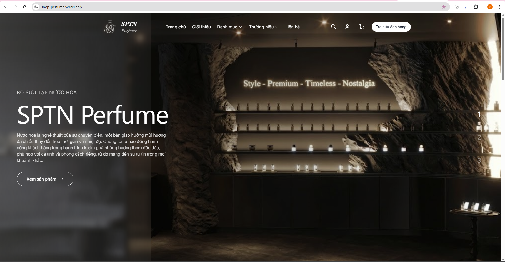

# 🛍️ Perfume Shop - Fullstack E-commerce Platform

**Shop Perfume** là một nền tảng thương mại điện tử hiện đại, chuyên dụng cho việc kinh doanh nước hoa cao cấp. Dự án được xây dựng với kiến trúc hướng hiệu năng, bảo mật cao và trải nghiệm người dùng mượt mà, tích hợp đầy đủ các giải pháp từ quản lý kho đến thanh toán tự động.

---

## 🚀 Tính Năng Cốt Lõi

### Đối với Khách hàng:
- **Trải nghiệm mua sắm mượt mà:** Tìm kiếm, lọc sản phẩm theo thương hiệu/danh mục và quản lý giỏ hàng thông minh.
- **Xác thực đa phương thức:** Đăng nhập an toàn qua JWT hoặc Google OAuth2.
- **Thanh toán tự động:** Tích hợp QR Code và xác thực giao dịch tức thì qua Webhook (SePay).
- **Đánh giá & Phản hồi:** Hệ thống Review giúp tăng độ tin cậy cho sản phẩm.

### Đối với Quản trị viên (Admin):
- **Dashboard chuyên sâu:** Theo dõi doanh thu, đơn hàng và tăng trưởng qua biểu đồ trực quan (Chart.js).
- **Quản lý kho (Inventory):** Hệ thống kiểm soát nhập/xuất và tồn kho theo thời gian thực.
- **Marketing:** Quản lý chiến dịch khuyến mãi với hệ thống Coupon linh hoạt.
- **Báo cáo chuyên nghiệp:** Xuất dữ liệu báo cáo đơn hàng/sản phẩm ra file Excel và PDF.

---

## 🛠️ Tech Stack

### Backend
- **Core:** Java 17, Spring Boot 3
- **Security:** Spring Security, JWT, OAuth2 (Google)
- **Database:** MariaDB, Spring Data JPA
- **Caching:** **Redis** (Tối ưu hóa hiệu năng và tốc độ phản hồi)
- **Communications:** Spring Mail (SMTP)
- **Utilities:** MapStruct, Lombok, SpringDoc OpenAPI (Swagger)

### Frontend
- **Core:** React 19, TypeScript, Vite
- **Styling:** Tailwind CSS, Framer Motion (Animations)
- **Icons:** Lucide React, React Icons
- **Data Viz:** Chart.js, React Chartjs 2
- **Tools:** Swiper (Slider), Axios, React Router 7

### Third-party Services
- **Cloudinary:** Quản lý và tối ưu hóa hình ảnh đám mây.
- **SePay:** Cổng tự động hóa ngân hàng (Webhook tích hợp).

---

## ⚡ Hệ Thống Caching với Redis

Trong dự án này, **Redis** đóng vai trò quan trọng trong việc tối ưu hóa hiệu suất hệ thống:

1.  **Cache sản phẩm & Danh mục:** Giảm tải cho database bằng cách lưu trữ các kết quả truy vấn phổ biến (như danh sách sản phẩm hot, danh mục) vào RAM, giúp tốc độ phản hồi API nhanh hơn gấp 5-10 lần.
2.  **Quản lý Session & OTP:** Lưu trữ tạm thời các mã xác thực và trạng thái đăng nhập để đảm bảo tốc độ truy xuất cực nhanh.
3.  **Hỗ trợ High Traffic:** Giúp hệ thống chịu tải tốt hơn trong các chiến dịch Flash Sale hoặc khi lượng người dùng truy cập đồng thời tăng cao.

---

## 📸 Demo & Screenshots

https://shop-perfume.vercel.app/

*Dự án này được xây dựng với mục tiêu thực hành các công nghệ mới nhất và áp dụng các Best Practices trong phát triển phần mềm.*
