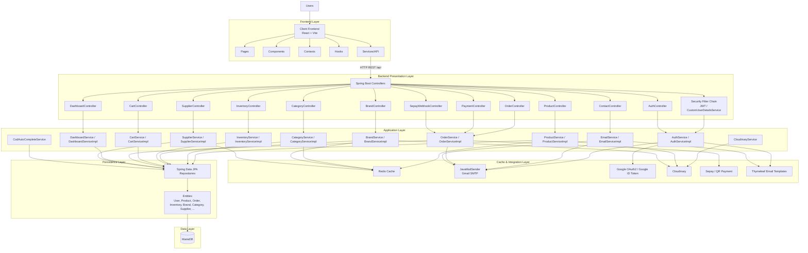
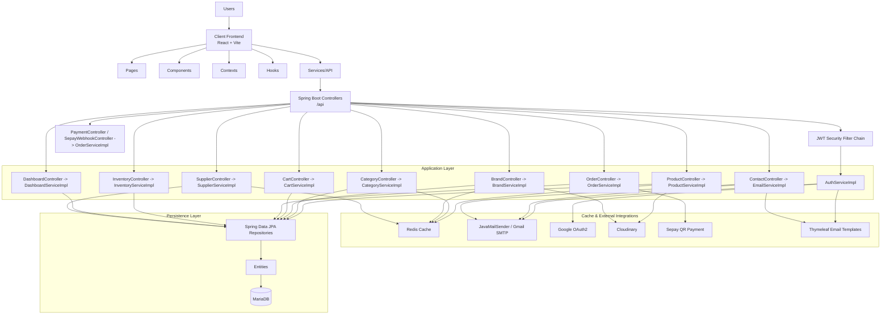

# Redis Cache & Layered Architecture

## 1. Redis Cache Dang Duoc Ap Dung

Project nay chua tung co cache layer, nen minh da them Redis qua Spring Cache cho cac du lieu doc nhieu, it thay doi.

### Cache namespaces

| Cache name | Du lieu duoc luu | TTL | Ghi chu |
|---|---|---:|---|
| `products` | `ProductService.findAll()`, `findById()`, `findBestSellers()`, `findByBrandId()`, `findByCategoryId()`, `getTotalSize()`, `getProductSummaries()` | 10 phut | Xoa cache khi tao/cap nhat/xoa product |
| `categories` | `CategoryService.findAll()`, `findById()` | 30 phut | Xoa cache khi tao/cap nhat/xoa category |
| `brands` | `BrandService.findAll()`, `findById()` | 30 phut | Xoa cache khi tao/cap nhat/xoa brand |
| `suppliers` | `SupplierService.findAll()`, `findById()` | 30 phut | Xoa cache khi tao/cap nhat/xoa supplier |

### Cach invalidation

- Khi thay doi product, cache `products` bi xoa het.
- Khi thay doi brand hoac category, cache cua chinh no va cache `products` deu bi xoa vi response product co long brand/category.
- Khi thay doi supplier, cache `suppliers` bi xoa het.

### Khong cache

- Page data co pagination/search phuc tap.
- Auth/JWT/refresh token flows.
- Order, dashboard, inventory luong dong manh.
- Email/SMTP/Google OAuth/Cloudinary/Sepay no rieng.

## 2. Redis Cau Hinh

Moi truong local dung mac dinh `127.0.0.1:6380`.
Moi truong production can set cac bien:

- `REDIS_HOST`
- `REDIS_PORT`
- `REDIS_PASSWORD`
- `REDIS_TIMEOUT`

Neu ban muon chay Redis bang Docker rieng de khong trung port voi project khac, dung:
- [server/docker-compose.redis.yml](../server/docker-compose.redis.yml)

Compose nay map:
- host `6380` -> container `6379`

Khi chay compose nay, dat:
- `REDIS_HOST=127.0.0.1`
- `REDIS_PORT=6380`

Cac cau hinh nam trong:
- [server/src/main/resources/application.properties](../server/src/main/resources/application.properties)
- [server/src/main/resources/application-prod.properties](../server/src/main/resources/application-prod.properties)

## 3. Layered Architecture Cua Project

### Tong quan

## 4. Giai thich tung layer

### Frontend Layer

- `pages`: cac man hinh chinh.
- `components`: UI reusable.
- `contexts`: auth/cart/search/filter state.
- `hooks`: business logic theo React hook.
- `services`: lop goi API sang backend.

### Backend Presentation Layer

- Controllers nhan request tu frontend.
- JWT filter va security chain kiem tra quyen truy cap.
- Controller chi lam nhiem vu dieu huong, khong chua business logic.

### Application Layer

- Day la noi nam business logic chinh.
- `AuthServiceImpl`: register/login/refresh token/reset password.
- `ProductServiceImpl`: product catalog va best seller.
- `CategoryServiceImpl`, `BrandServiceImpl`, `SupplierServiceImpl`: data danh muc.
- `InventoryServiceImpl`: ton kho.
- `OrderServiceImpl`: checkout, payment, webhook, order lifecycle.
- `EmailServiceImpl`: gui mail reset password, welcome, order confirmation, contact.

### Cache & Integration Layer

- Redis: cache du lieu doc nhieu.
- Gmail SMTP: gui email qua Spring Mail.
- Google OAuth: dang nhap Google.
- Cloudinary: upload/quan ly hinh anh.
- Sepay: thanh toan QR.
- Thymeleaf: render template email HTML.

### Persistence Layer

- Repository truy xuat database.
- Entity map truc tiep sang bang MariaDB.

### Data Layer

- MariaDB la nguon du lieu chinh.

## 5. Mermaid rieng de dan vao draw.io

